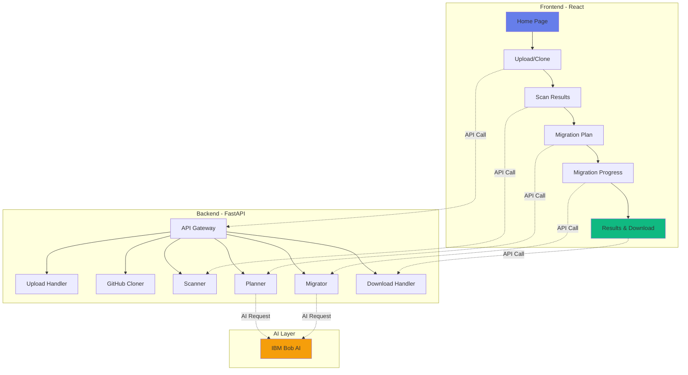

# 🔧 Legacy Code Surgeon AI

<div align="center">

**AI-Powered Django to FastAPI Migration Platform**

[](https://www.python.org/downloads/)
[](https://reactjs.org/)
[](https://fastapi.tiangolo.com/)
[](LICENSE)

</div>

---

## 📋 Table of Contents

- [Overview](#overview)
- [Features](#features)
- [Architecture](#architecture)
- [Project Structure](#project-structure)
- [Installation](#installation)
- [Usage](#usage)
- [API Documentation](#api-documentation)
- [Screenshots](#screenshots)
- [Technology Stack](#technology-stack)
- [Contributing](#contributing)

---

## 🎯 Overview

Legacy Code Surgeon AI is an intelligent platform that automates the migration of Django projects to FastAPI using IBM Bob AI. It analyzes your codebase, generates migration plans, and performs automated code transformation with AI-powered insights.

### Key Capabilities

- 📦 **Upload or Clone** - Support for ZIP uploads and GitHub repository cloning
- 🔍 **Smart Detection** - Automatic Django framework detection
- 🤖 **AI-Powered** - Uses IBM Bob AI for intelligent code transformation
- 📊 **Visual Progress** - Real-time migration progress with animated indicators
- 📥 **Easy Download** - Download migrated projects as ZIP files

---

## ✨ Features

<table>
<tr>
<td width="50%">

### Frontend Features
- ✅ Modern React 18 UI
- ✅ Multi-screen workflow
- ✅ Animated progress bars
- ✅ Step-by-step indicators
- ✅ Responsive design
- ✅ Real-time status updates

</td>
<td width="50%">

### Backend Features
- ✅ FastAPI REST API
- ✅ IBM Bob AI integration
- ✅ Django framework detection
- ✅ Automated code transformation
- ✅ ZIP file generation
- ✅ Error handling & validation

</td>
</tr>
</table>

---

## 🏗️ Architecture

<div align="center">



</div>

---

## 📂 Project Structure

```
legacy-code-surgeon-ai/
├── backend/                    # FastAPI Backend
│   ├── app/
│   │   ├── api/               # API Endpoints
│   │   │   ├── upload.py      # File upload
│   │   │   ├── github.py      # GitHub cloning
│   │   │   ├── scan.py        # Repository scanning
│   │   │   ├── plan.py        # Migration planning
│   │   │   ├── migrate.py     # Code migration
│   │   │   ├── status.py      # Status checking
│   │   │   └── download.py    # ZIP download
│   │   ├── core/              # Core Logic
│   │   │   ├── bob_client.py  # IBM Bob AI client
│   │   │   ├── scanner.py     # Framework detection
│   │   │   ├── detector.py    # Pattern detection
│   │   │   ├── planner.py     # Migration planning
│   │   │   ├── migrator.py    # Code transformation
│   │   │   ├── transformer.py # Code converter
│   │   │   └── validators.py  # Code validation
│   │   ├── models/            # Data Models
│   │   │   └── schemas.py     # Pydantic schemas
│   │   ├── utils/             # Utilities
│   │   │   └── file_utils.py  # File operations
│   │   ├── storage/           # File Storage
│   │   │   ├── uploads/       # Uploaded files
│   │   │   ├── repos/         # Cloned repos
│   │   │   └── migrated/      # Migrated code
│   │   └── main.py            # FastAPI app
│   └── requirements.txt       # Python dependencies
│
├── frontend/                   # React Frontend
│   ├── src/
│   │   ├── components/        # React Components
│   │   │   ├── Header.jsx     # Navigation header
│   │   │   ├── ProgressBar.jsx # Progress indicator
│   │   │   └── StepIndicator.jsx # Workflow steps
│   │   ├── pages/             # Page Components
│   │   │   ├── Home.jsx       # Landing page
│   │   │   ├── ScanResults.jsx # Scan results
│   │   │   ├── MigrationPlan.jsx # Migration plan
│   │   │   ├── MigrationProgress.jsx # Progress view
│   │   │   └── Results.jsx    # Final results
│   │   ├── services/          # API Services
│   │   │   └── api.js         # API client
│   │   ├── styles/            # CSS Styles
│   │   │   └── App.css        # Global styles
│   │   ├── App.jsx            # Main app
│   │   └── main.jsx           # Entry point
│   ├── public/
│   │   └── index.html         # HTML template
│   ├── package.json           # Node dependencies
│   └── vite.config.js         # Vite config
│
└── README.md                   # This file
```

---

## 🚀 Installation

### Prerequisites

- **Python 3.11+**
- **Node.js 16+**
- **IBM Bob AI API Key**

### Backend Setup

```bash
# Navigate to backend directory
cd backend

# Create virtual environment
python -m venv venv

# Activate virtual environment
# Windows:
venv\Scripts\activate
# Linux/Mac:
source venv/bin/activate

# Install dependencies
pip install -r requirements.txt

# Create .env file
echo "BOB_AI_API_KEY=your_api_key_here" > .env

# Start backend server
uvicorn app.main:app --reload
```

Backend will run on: **http://localhost:8000**

### Frontend Setup

```bash
# Navigate to frontend directory
cd frontend

# Install dependencies
npm install

# Start development server
npm run dev
```

Frontend will run on: **http://localhost:3000**

---

## 📖 Usage

### Workflow Diagram

```
┌─────────────────────────────────────────────────────────────────────────┐
│                         Migration Workflow                               │
├─────────────────────────────────────────────────────────────────────────┤
│                                                                          │
│   ┌────────┐      ┌────────┐      ┌────────┐      ┌────────┐      ┌────────┐   │
│   │   📦   │  →   │   🔍   │  →   │   📋   │  →   │   ⚡   │  →   │   📥   │   │
│   │ Upload │      │  Scan  │      │  Plan  │      │Migrate │      │Download│   │
│   └────────┘      └────────┘      └────────┘      └────────┘      └────────┘   │
│                                                                          │
│   Upload ZIP      Detect         Generate        Execute        Download    │
│   or Clone        Django         Migration       AI-Powered    Migrated    │
│   from GitHub     Framework      Plan            Migration     ZIP File    │
│                                                                          │
└─────────────────────────────────────────────────────────────────────────┘
```

### Step-by-Step Guide

#### 1. **Upload Project**
- Open http://localhost:3000
- Choose upload method:
  - **ZIP Upload**: Drag & drop or browse for ZIP file
  - **GitHub Clone**: Enter repository URL
- Wait for upload/clone to complete

#### 2. **View Scan Results**
- Automatic framework detection
- View detected patterns
- See file statistics
- Review project summary

#### 3. **Generate Migration Plan**
- AI generates comprehensive plan
- View migration steps
- Review potential issues
- See optimization suggestions

#### 4. **Execute Migration**
- Watch real-time progress
- Step-by-step transformation
- Circular progress indicator
- Automatic completion

#### 5. **Download Results**
- View migration statistics
- Download migrated code as ZIP
- Start new migration

---

## 📡 API Documentation

### Base URL
```
http://localhost:8000
```

### Endpoints

<table>
<tr>
<th>Method</th>
<th>Endpoint</th>
<th>Description</th>
</tr>
<tr>
<td><code>GET</code></td>
<td><code>/</code></td>
<td>API root - health check</td>
</tr>
<tr>
<td><code>GET</code></td>
<td><code>/health</code></td>
<td>Health status & Bob AI config</td>
</tr>
<tr>
<td><code>POST</code></td>
<td><code>/api/upload</code></td>
<td>Upload ZIP file</td>
</tr>
<tr>
<td><code>POST</code></td>
<td><code>/api/github</code></td>
<td>Clone GitHub repository</td>
</tr>
<tr>
<td><code>GET</code></td>
<td><code>/api/scan/{project_id}</code></td>
<td>Scan repository</td>
</tr>
<tr>
<td><code>POST</code></td>
<td><code>/api/plan/{project_id}</code></td>
<td>Generate migration plan</td>
</tr>
<tr>
<td><code>POST</code></td>
<td><code>/api/migrate/{project_id}</code></td>
<td>Execute migration</td>
</tr>
<tr>
<td><code>GET</code></td>
<td><code>/api/status/{project_id}</code></td>
<td>Check project status</td>
</tr>
<tr>
<td><code>GET</code></td>
<td><code>/api/download/{project_id}</code></td>
<td>Download migrated ZIP</td>
</tr>
</table>

### Interactive Documentation

- **Swagger UI**: http://localhost:8000/docs
- **ReDoc**: http://localhost:8000/redoc

---

## 📸 Screenshots

### Home Page
```
┌─────────────────────────────────────────┐
│  🔧 Legacy Code Surgeon AI              │
│  Modernize your legacy code with AI     │
├─────────────────────────────────────────┤
│  📦 Upload ZIP    🐙 Clone from GitHub  │
│  ┌───────────────────────────────────┐  │
│  │   Drop your ZIP file here         │  │
│  │   or click to browse              │  │
│  └───────────────────────────────────┘  │
└─────────────────────────────────────────┘
```

### Migration Progress
```
┌─────────────────────────────────────────┐
│  ⚡ Migration in Progress                │
│  Converting to FASTAPI                   │
├─────────────────────────────────────────┤
│         ╭─────────╮                      │
│         │   75%   │  ← Circular Progress │
│         ╰─────────╯                      │
│                                          │
│  ✓ Creating backup snapshot...          │
│  ✓ Analyzing source code structure...   │
│  ⏳ Converting models and entities...    │
│  ○ Migrating routes and controllers...  │
└─────────────────────────────────────────┘
```

---

## 🛠️ Technology Stack

### Frontend
- **React 18** - UI library
- **React Router 6** - Client-side routing
- **Axios** - HTTP client
- **Vite** - Build tool
- **CSS3** - Styling with animations

### Backend
- **FastAPI** - Modern Python web framework
- **Pydantic** - Data validation
- **IBM Bob AI** - AI-powered code transformation
- **Python 3.11+** - Programming language

### DevOps
- **Uvicorn** - ASGI server
- **Git** - Version control

---

## 🎨 Design Features

### UI/UX Highlights

#### 🎭 Animations
- Fade-in effects
- Slide-up transitions
- Pulse animations
- Shimmer progress bars

#### 📊 Progress Tracking
- Thick animated bars
- Circular indicators
- Step-by-step display
- Real-time updates

#### 🎨 Visual Design
- Purple gradient theme
- Card-based layouts
- Smooth hover effects
- Responsive grids

#### 📱 Responsive
- Mobile-friendly
- Touch-optimized
- Flexible layouts
- Adaptive components

---

## 🔒 Security Notes

⚠️ **This is a development/demo version**

For production deployment, implement:
- ✅ Authentication & authorization
- ✅ Input validation & sanitization
- ✅ Rate limiting
- ✅ HTTPS enforcement
- ✅ CORS configuration
- ✅ File size limits
- ✅ Virus scanning

---

## 🤝 Contributing

Contributions are welcome! Please follow these steps:

1. Fork the repository
2. Create a feature branch (`git checkout -b feature/AmazingFeature`)
3. Commit your changes (`git commit -m 'Add some AmazingFeature'`)
4. Push to the branch (`git push origin feature/AmazingFeature`)
5. Open a Pull Request

---

## 📄 License

This project is licensed under the MIT License - see the [LICENSE](LICENSE) file for details.

---

## 👥 Authors

- **Development Team** - Initial work

---

## 🙏 Acknowledgments

- IBM Bob AI for intelligent code transformation
- FastAPI community for excellent documentation
- React team for the amazing framework

---

## 📞 Support

For issues, questions, or suggestions:
- 📧 Email: support@example.com
- 🐛 Issues: [GitHub Issues](https://github.com/yourusername/legacy-code-surgeon-ai/issues)
- 📖 Docs: [Documentation](https://docs.example.com)

---

<div align="center">

**Made with ❤️ using React, FastAPI, and IBM Bob AI**

⭐ Star this repo if you find it helpful!

</div>